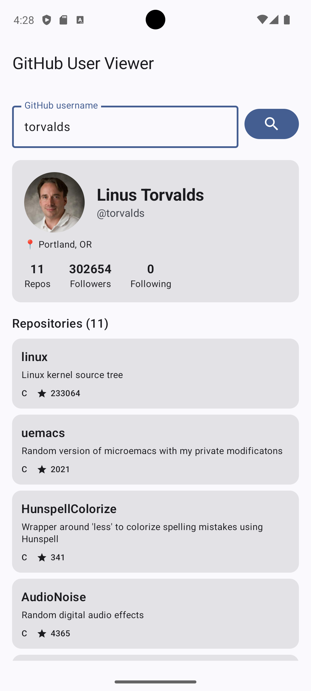
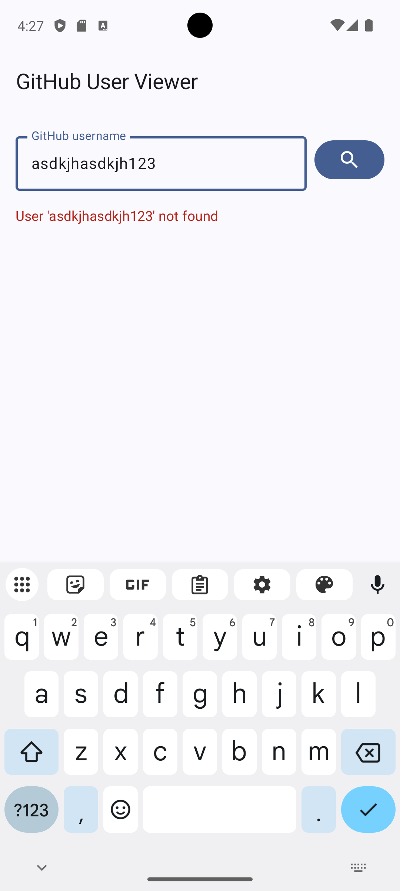

# GitHub User Viewer

A simple Android app that displays GitHub user profiles and their public repositories.
Built to learn modern Android development with Jetpack Compose, Retrofit, and coroutines.

## Features

- Search GitHub users by username
- View user profile (avatar, bio, location, follower stats)
- Browse user's public repositories sorted by latest update
- Tap any repo to open it in the browser
- Proper loading and error states (network errors, user not found, rate limits)

## Screenshots

| Linux Torvalds | My profile | User not found |
|---------|-------------|-------------|
|  |  |  |

## Tech Stack

- **Language:** Kotlin
- **UI:** Jetpack Compose, Material 3
- **Networking:** Retrofit 2 + Moshi
- **Async:** Kotlin Coroutines + StateFlow
- **Architecture:** MVVM with single-activity Compose
- **Image loading:** Coil

## Architecture

The project is organized into two main layers:

- **ui/** - Composables and ViewModel (presentation layer)
- **data/api/** - Retrofit interface + singleton instance (network layer)
- **data/model/** - Data classes mapped from GitHub REST API (domain models)

The app follows MVVM:

- `UserViewModel` exposes a `StateFlow<UiState>` representing the current screen state
- `UiState` is a sealed interface with `Idle`, `Loading`, `Success`, `Error` cases
- Composables observe state and dispatch user actions back to the ViewModel
- Errors are categorized into IOException (no network) and HttpException (server errors, 404 user not found, 403 rate limit)

## Setup

1. Clone the repo
2. Open in Android Studio (Ladybug or newer)
3. Run on an emulator or device with Android 8.0+ (API 26)

No API key required - uses GitHub's public REST API (rate-limited to 60 requests/hour for unauthenticated requests).

## What I'd add next

- DataStore caching for offline browsing of recently viewed profiles
- Pagination for users with many repositories
- Dependency injection with Hilt for proper testability
- Repository layer between ViewModel and API
- Unit tests for the ViewModel with MockK and Turbine
- UI tests with Compose testing APIs

## Author

Bohdan - Computer Science student at Dublin City University
